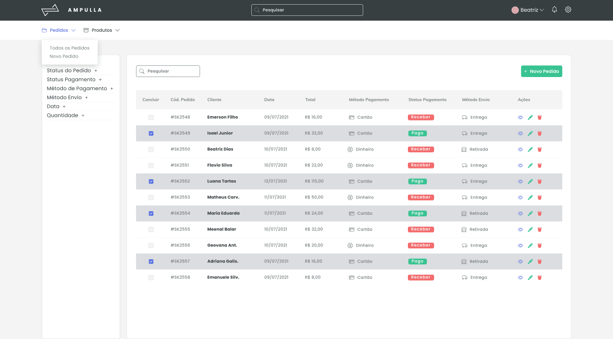

<p align="center">
 
</p>

## Projeto

Order Manager is a project to help companies to have more control about yours orders, products and consumers.
<br>
The project began with the difficulty of an MEI (Individual Microentrepreneur) and even a small company, [which account for more than 56.7% of the total business in operation in Brazil](https://www.gov.br/pt-br/noticias/trabalho-e-previdencia/2021/03/cresceu-o-numero-de-microempreendedores-individuais-em-2020#:~:text=O%20n%C3%BAmero%20de%20Microempreendedores%20Individuais%20(MEI)%20cresceu%20no%20pa%C3%ADs%20ao,rela%C3%A7%C3%A3o%20ao%20ano%20de%202019.), in managing all their orders, products and customers.


## Features v.1.0

- Adding and Editing Products
- Adding and Editing Orders


## Technologies v.1.0

- React Js
- Redux
- Hooks
- Router Dom
- Testing Library
- SASS

## Planning / Development

The planning and development about this project can be access in [Notion](https://foamy-bear-4ed.notion.site/Order-System-3801c5db5dbd4d73b550d90f7832a08d).

## Layout

The layout about this project can be access in [this link](https://www.figma.com/file/maWCp4iz0oXmRbEEp51Wv7/sistemaDePedidos?node-id=0%3A1).


## Executing the project

Use the **yarn** ou the **npm install** to install the project dependencies.
Then start the project.

```cl
npm start
```

<br />
